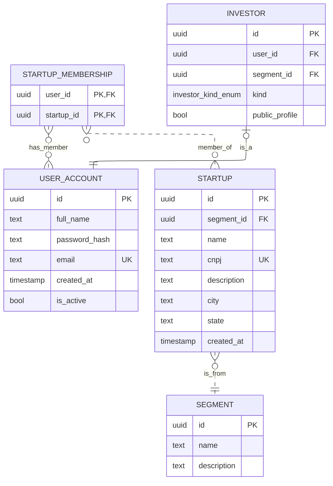

# SENAC PI 2026

```mermaid
---
config:
  layout: elk
---
erDiagram
USER_ACCOUNT {
    uuid id PK
    text full_name
    text password_hash
    text email UK
    timestamp created_at
    bool is_active
}

SEGMENT {
    uuid id PK
    text name
    text description
}

STARTUP }o..|| SEGMENT : is_from
STARTUP {
    uuid id PK
    uuid segment_id FK
    text name
    text cnpj UK
    text description
    text city
    text state
    timestamp created_at
}

STARTUP_MEMBERSHIP }o..o{ USER_ACCOUNT : has_member
STARTUP_MEMBERSHIP }o..o{ STARTUP : member_of
STARTUP_MEMBERSHIP {
    uuid user_id PK, FK
    uuid startup_id PK, FK
}

INVESTOR |o--|| USER_ACCOUNT : is_a
INVESTOR {
    uuid id PK
    uuid user_id FK
    uuid segment_id FK
    investor_kind_enum kind
    bool public_profile
}
```
